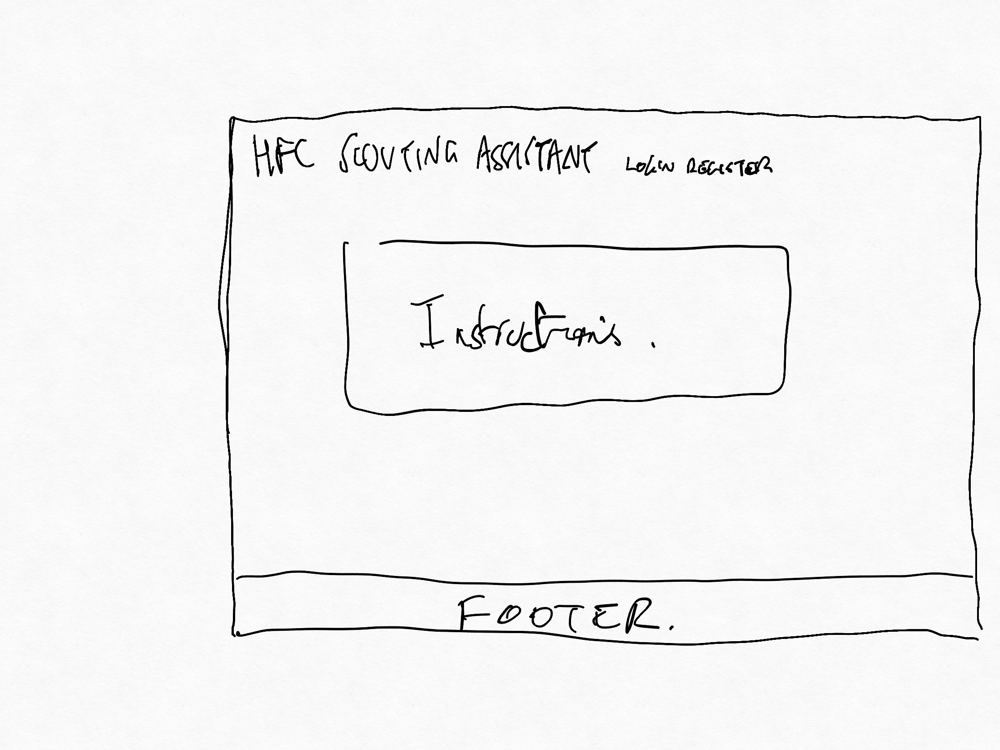
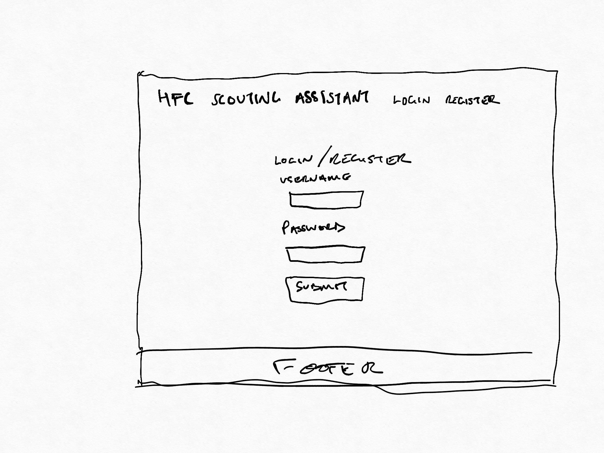
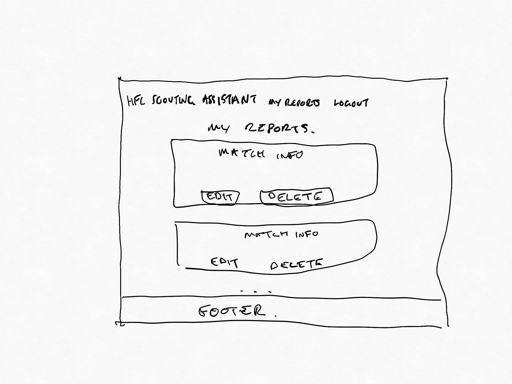
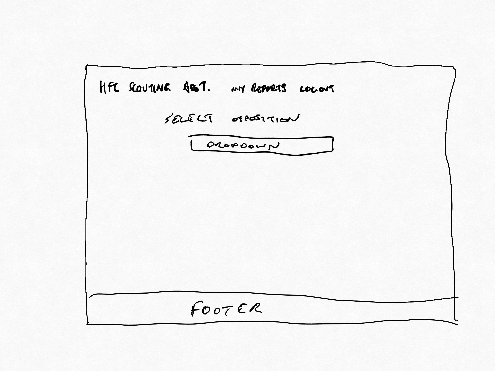
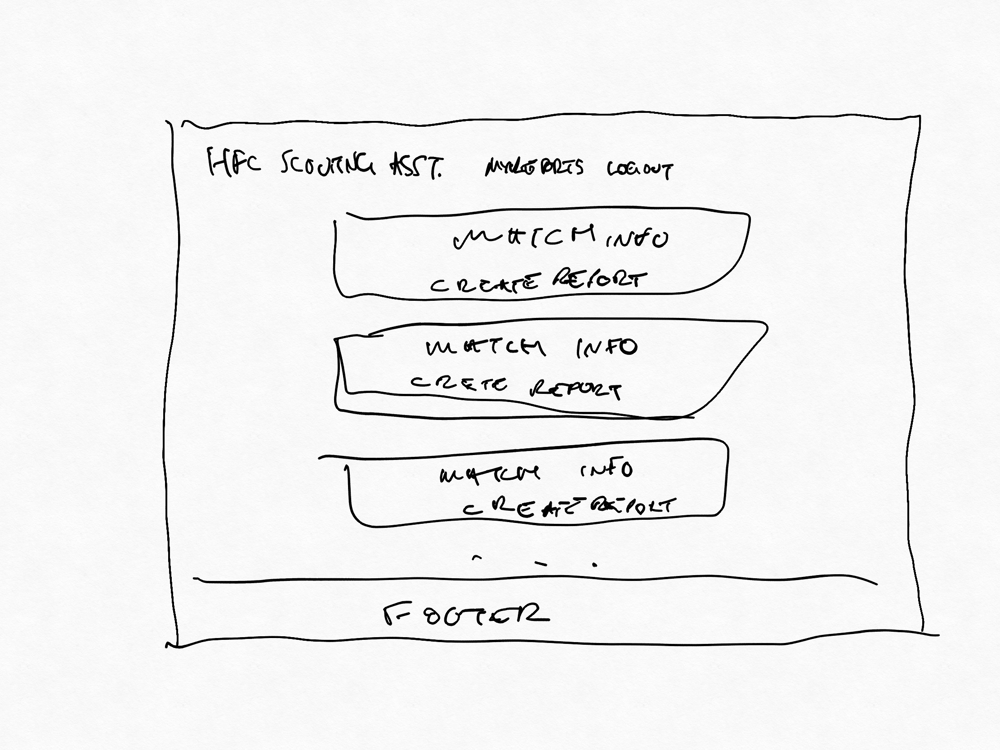
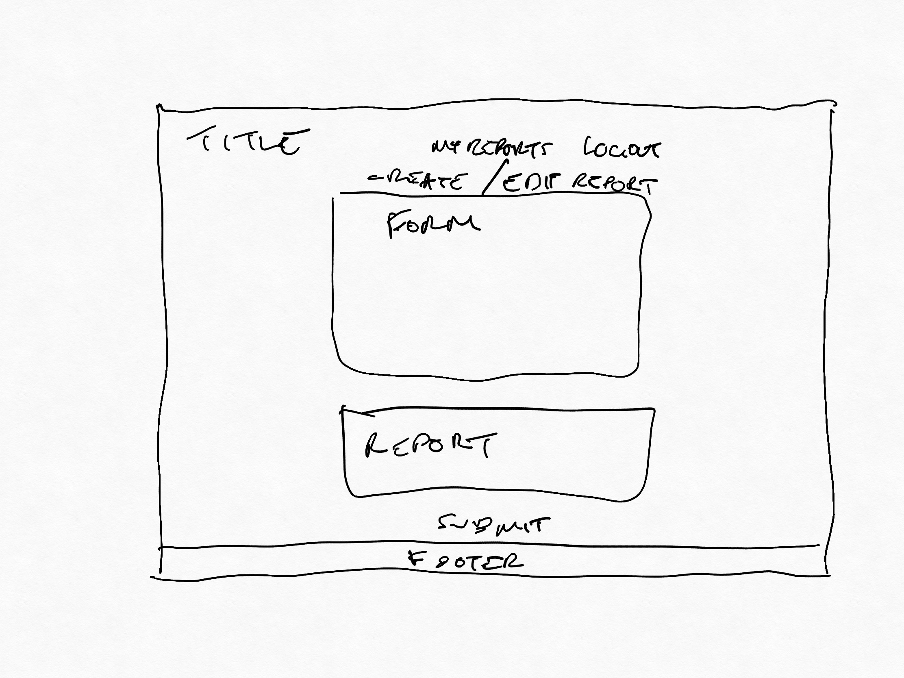

# Milestone Project 3
## Description
---
This is my third milestone project from the full stack web developer course by Code Institute.
This project was for the data centric section of the course. The purpose of this project was to build an application 
with Python on the backend using the Flask framework. The project should include functionality to make all the CRUD
 operations on a Database, which for this project would be MongoDB.
 
I chose to create a mock of a scouting hub that would be used by a specific team. I chose to mimic this on Hibs as
its the team I support. This would allow a user to create reports on a Hibs match of their choosing.

[Deployed Website](http://jb-milestone-project-3.herokuapp.com/)

## UX/UI
---
I wanted this to look like a professional tool as it is effectively mimicking something that would be used in a 
professional environment. For this reason I have kept the color theme extremely minimal. My initial thought was to use 
Hibs colors all the way throughout the app but I thought it may be a bit too much. I have used splashes of Hibs colors 
just for the buttons so that it isn't all just black and white.

I chose the font Source Sans Pro as I thought it looked very professional whilst being a little more aesthetically 
pleasing than say Aerial. I chose to use this one font all the way throughout my website.

I only created Desktop wireframes as they will be exactly the same on Mobile. Everything will be on top of each other 
vertically.

### User Stories
* I want to be able to search for matches by opponent.
* I want to be able to see the score of a particular match.
* I want to be able to see the date of a match.
* I want to be able to see the venue of a match.
* I want to be able to add a match report to a particular match.
* I want to be able to edit a report from a particular match.
* I want to be able to delete a report from a particular match.

### Wireframes
#### Desktop

## Features
---
#### Current Features

Current features of this website include the ability to search for all Hibs league games since 2010 and create and store 
a report on any particular game. A user also has the ability to edit or delete a report already created by themselves. 
Users can also see a list of reports created by themselves. A user cannot see or perform any updates to a report created 
by another user.

#### Future Features

Future features will hopefully be to find another API that offers further historical data and possibly more player and 
match stats so that the user can see the stats live in the site whilst creating a report.
I would also look to create a more robust solution for user authentication.

## Technologies/Support Used
---
Below is a list of technologies I used to build my dashboard.
* HTML - HTML5 provided the structure of my website. I tried to use semantic elements where possible to ensure the best structure.
* CSS - Used to style my page.
* [Bootstrap](https://getbootstrap.com/) - Used primarily for the grid system. I find this a really good way to position my elements where I want them.
* [VSCode](https://code.visualstudio.com) - This is my text editor. It has a built in terminal so I could do everything I needed to from one environment.
* [Git](https://git-scm.com) - Git was used for version control. Allowing me to create backups whenever significant changes were made to my code.
* [GitHub](https://github.com/) - This is where my repository is held externally. I will also use GitHub pages to deploy my website.
* [Google Fonts](https://fonts.google.com/) - Used to import specific fonts I wanted to use on my website.
* [Python](https://www.python.org/) - Python was the language used to build the backend of the website.
* [Flask](http://flask.palletsprojects.com/en/1.1.x/) - Python framework used in order to build out the routes/views of my website.
* [MongoDB Atlas](https://cloud.mongodb.com/) - NoSQL database used to store user and report details.
* [API-Football](https://rapidapi.com/api-sports/api/api-football/) - The API i used to get match data.

## Testing
---

## Bugs
---
No Bugs to note.

## Deployment
---
My website was created using VSCode. VSCode is a text editor with a built in terminal. I chose to use a text editor/IDE 
outside of AWS Cloud9 to gain experience working outside of a browser. Once I had created my file structure and first 
HTML page, i initiated a local repository using GIT which was downloaded onto my machine previously. I then created an 
external repository in GitHub and linked the local and external repositories. This allowed me to version control 
throughout the lifespan of the development.

* I created a new environment in VS Code
* Created a new virtual environment.
* In the bash terminal, entered 'git init'
* Created all my folders and files.
* Entered 'git add .' into the bash terminal
* Entered 'git commit' into the bash terminal and created my initial commit
* I then linked my local git repository to a GitHub repository.
* I then followed the below steps to deploy the site to Heroku.

To deploy the website to Heroku, I followed the below steps:
* Created an Heroku Account.
* Created a new project.
* From the deployment method section of the Deploy tab, I selected GitHub, and then entered my github repo link in the 
field provided.
* Every time I push to GitHub it will automatically send the updates across to Heroku.
* I then also had to create some Config Vars in the settings tab, to reflect the environment variables created 
in the .flaskenv file that is in .gitignore.
* [Website Link](http://jb-milestone-project-3.herokuapp.com/)

### To run this project locally

* Follow this link to the [GitHub Repository](https://github.com/jboyd8/milestone-project-3)
* Click on the 'Clone or Download' button.
* Copy the URL provided.
* Open a bash terminal, move to your desired directory.
* Type 'git clone' and paste in the URL.
* Create a .flaskenv file and store three environment variables. (API_KEY, MONGO_URI and SECRET_KEY)
* In order to complete this you will need a MongoDB Atlas account and an account with API Football.

## Credits
---
* To my mentor, [Reuben Ferrante](https://github.com/arex18), for guiding me through the process and offering assistance when necessary to point me in the right direction.
* The Slack community. The help a student is able to receive from the other students is a really great tool to have.
* [HTML Color Code](https://htmlcolorcodes.com/) - Used this website in order to obtain hex codes whilst styling my pages.
* [W3C Validator](https://validator.w3.org/#validate_by_input) - A validator used to check my HTML and CSS structure and format periodically throughout the build.
* Concepts iOS app - Used to build wireframes.

